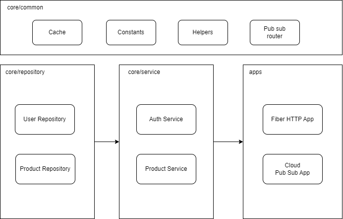

# Golang Starter Project

Golang starter for building Rest API and Pub Sub App that with shared core business logic

# Concept

Our starter concept is inspired from NestJS who can shared one core business logic to create multiple kind of app. That means you can create Restful API and Pubsub App with same logic.



There are some component you should know such as

1. core/repository  
Dealing data operation for business logics, data can be from DB or other APIs.
2. core/service  
Business logic that will be using to your app.
3. apps  
Your apps will be here. Apps can be Restful API, Cloud Pub Sub, RabbitMQ Subscriber, etc.
4. core/common  
Shared library for across project, it can be helpers, contants, cache library, etc.

## Depedencies
* [Go Fiber](https://docs.gofiber.io/) 
* [GORM with MySQL Driver](https://gorm.io/docs/index.html)
* [dotenv loader](https://github.com/joho/godotenv)
* [MongoDB Driver](https://www.mongodb.com/docs/drivers/go/current/quick-start/)
* [Fiber zap logger](https://docs.gofiber.io/contrib/fiberzap/)
* [Cloud Pubsub](https://pkg.go.dev/cloud.google.com/go/pubsub) 

## Download depedencies
``` bash
go mod download
```

## Running http app
``` bash
go run cmd/http_server/main.go
```

## Running cloud pubsub app
``` bash
go run cmd/pubsub_server/main.go
```
